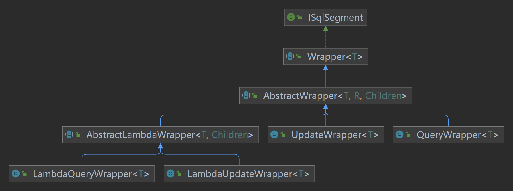
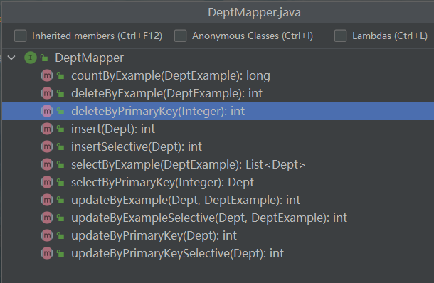
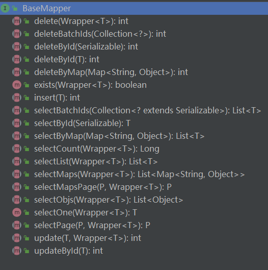
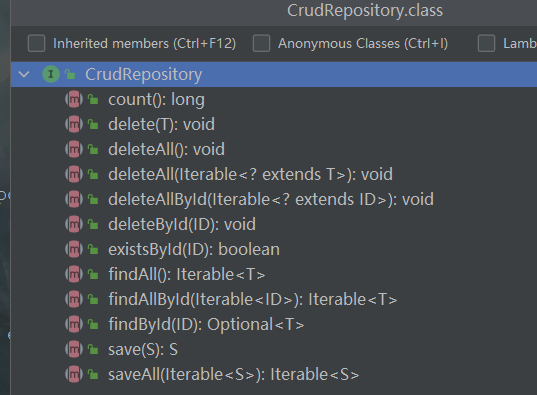
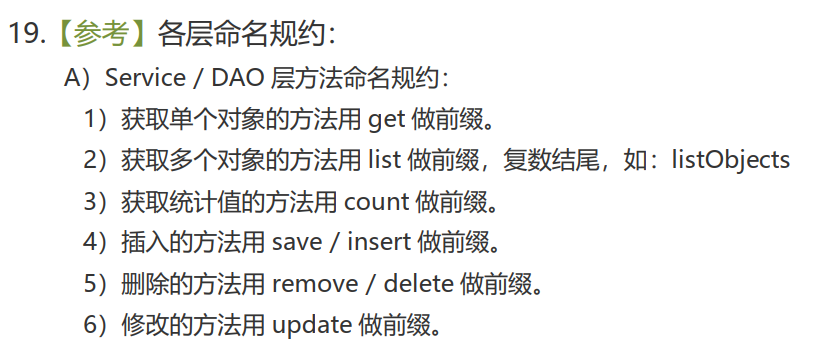

# backend-mybatis-learning

[MyBatis的GitHub](https://github.com/mybatis/mybatis-3)

[MyBatis的中文网](https://mybatis.org/mybatis-3/zh/index.html)

[bilibili学习地址之MyBatis（杨博超）](https://www.bilibili.com/video/BV1VP4y1c7j7?p=1&vd_source=b850b3a29a70c8eb888ce7dff776a5d1)

[bilibili学习地址之MyBatisPlus（杨博超）](https://www.bilibili.com/video/BV12R4y157Be/?spm_id_from=333.788.recommend_more_video.0&vd_source=b850b3a29a70c8eb888ce7dff776a5d1)

[SSM框架全套教程（杨博超）](https://www.bilibili.com/video/BV1Ya411S7aT/?spm_id_from=333.788.recommend_more_video.0&vd_source=b850b3a29a70c8eb888ce7dff776a5d1)

[MyBatis书籍：TK](https://mybatis.io/)

[GItHub：TK](https://github.com/abel533/Mapper)

[MyBatisPlus官网](https://baomidou.com/)

[MyBatisPlus GitHub](https://github.com/baomidou/mybatis-plus)

[mybatis-generator-gui](https://github.com/zouzg/mybatis-generator-gui)

[EhCache](https://www.ehcache.org/)

[TK通用Mapper和Mybatis-Plus使用对比](https://www.jianshu.com/p/d4d2362d7581)

https://www.bilibili.com/video/BV1Ya411S7aT?p=186&spm_id_from=pageDriver&vd_source=b850b3a29a70c8eb888ce7dff776a5d1

基础宋红康，进阶张益桃，框架杨博超，springboot雷神

## mybatis-demo1

- 配置文件的基本使用

## mybatis-demo2

- 查询参数
- 查询结果
- 查询的特殊情况（like、in、dynamic tableName、获取自增主键等）

## mybatis-demo3

- 一对多，多对一

- 一级缓存、二级缓存

- EhCache缓存

[mybatis的一级缓存二级缓存都会有问题](https://blog.csdn.net/qq_42861526/article/details/122300126)

## mybatis-mbg

- 逆向工程
- 分页插件

## mybatis-sbsm

- Wrapper：条件构造抽象类，最顶端父类。
  - AbstractWrapper：用于查询条件封装，生成sql的where条件。
    - QueryWrapper：查询条件封装
    - UpdateWrapper：Update条件封装
    - AbstractLambdaWrapper：使用Lambda语法
      - LambdaQueryWrapper：用于Lambda语法使用的查询Wrapper
      - LambdaUpdateWrapper：Lambda更新封装Wrapper。

## EhCache配置文件说明：

| 属性名                          | 是否必须 | 作用                                                         |
| ------------------------------- | -------- | ------------------------------------------------------------ |
| maxElementsInMemory             | 是       | 在内存中缓存的element的最大数目                              |
| maxElementsOnDisk               | 是       | 在磁盘上缓存的element的最大数目，若是0表示无穷大             |
| eternal                         | 是       | 设定缓存的elements是否永远不过期。如果true，则缓存的数据始终有效，如果为false那么还要根据timeToIdleSeconds、timeToLiveSeconds判断 |
| overflowToDisk                  | 是       | 设定当内存缓存溢出时是否将过期的element缓存到磁盘上。        |
| timeToIdleSeconds               | 否       | 当缓存在EhCache中的数据前后两次访问的时间超过timeToIdleSconds的属性取值时，这些数据便会删除，默认值是0，也就是可限制时间无穷大。 |
| timeToLiveSeconds               | 否       | 缓存element的有效生命期，默认是0，也就是element存活的时间无穷大 |
| diskSpoolBufferSizeMB           | 否       | DiskStore（磁盘缓存）的缓存区大小。默认是30MB。每个Cache都应该有自己的一个缓冲区。 |
| diskPersistent                  | 否       | 在VM重启的时候是否启用磁盘保存EhCache中的数据，默认是false   |
| diskExpiryThreadIntervalSeconds | 否       | 磁盘缓存的清理线程运行间隔，默认是120秒。每隔120s，相应的线程会进行一次EhCache中数据的清理工作。 |
| memoryStoreEvictionPolicy       | 否       | 当内存缓存达到最大，有新的element加入的时候，移除缓存中element的策略。默认是LRU（最近最少使用），可选的有LFU（最不常使用）和FIFO（先进先出） |

## 数据库操作方法命名规范

### MyBatis

### MyBatisPlus

### JPA

### 数据库增删改查：CDUR，习惯性说法CRUD

- 新增：create
- 删除：delete
- 修改：update

- 查询：read（又说：retrieve，检索）

### schame的维护：create/drop/alter

### 正确命名具有互斥意义的标识符

用正确的反义词组命名具有互斥意义的标识符 ，如

add / remove       begin / end        create / destroy

insert / delete       first / last         get / release

increment / decrement                 put / get

add / delete         lock / unlock      open / close

min / max          old / new         start / stop

next / previous      source / target     show / hide

send / receive       source / destination

cut / paste          up / down

### 阿里巴巴规约

### 汇总：

- 新增：【save/insert/create】
  - save：新增或者更新，自动维护审计字段
  - insert：新增，手工维护审计字段【推荐】
  - create：新增，自动维护审计字段

审计字段：deleted、version、createdBy、createdTime、lastModifiedBy、lastModifiedTime

- 删除：前缀【remove/delete】
  - remove：逻辑删除【推荐】
  - delete：物理删除【推荐】

- 修改：前缀【update/modify】
  - update：维护数据【推荐】
  - modify：维护结构

- 查询：前缀【find/select/get/search/query/list/acquire/lookfor】
  - find：强调找的结果
  - get：得到，获得【不推荐】
  - search：强调找的过程
  - select：选择【推荐】
  - query：
  - list：【不推荐】list太常用，经常有userList等情况出现在代码中，list作为前缀怪异

- 统计：前缀【count/stat/avg/max/min/often/partly】
  - count：【推荐】
  - stat：【推荐】

### `flyin`推荐的一套【推荐】

- 新增
  - insert
    - insert
- 删除
  - delete：物理删除
    - deleteById
    - deleteBatchIds
  - remove：逻辑删除
    - removeById
    - removeList
    - removeAll
- 修改
  - update
    - updateById
    - update
- 查询
  - select
    - selectOne
    - selectById
    - selectList
    - selectCount
    - selectStat
    - selectAll
- 统计
  - count
  - stat
